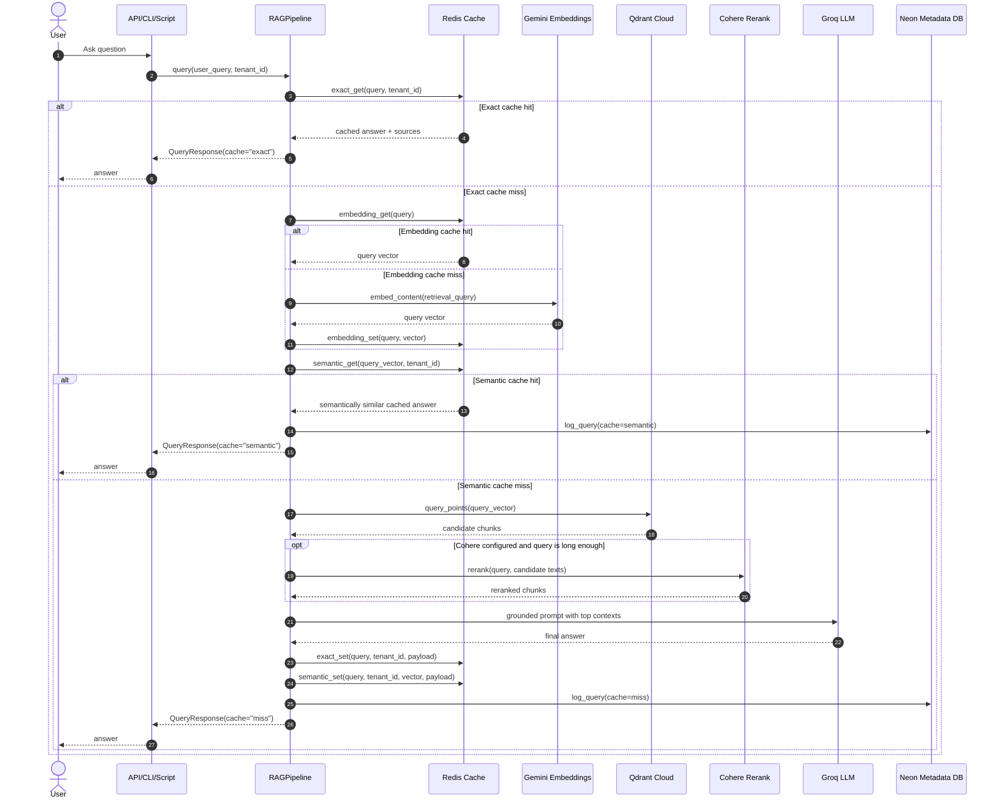

# Code Flow Guide

This document explains the codebase in the same order the program executes.

## Reading Order

If you want to understand the project quickly, read files in this order:

1. `README.md` for setup and entrypoints.
2. `src/rag_cloud/config.py` for all environment-driven settings.
3. `src/rag_cloud/clients.py` for external service clients.
4. `src/rag_cloud/cache.py` for the three cache layers.
5. `src/rag_cloud/pipeline.py` for the full query flow.
6. `src/rag_cloud/api.py` and `src/rag_cloud/cli.py` for app entrypoints.
7. `scripts/bootstrap_cloud.py` for first-time environment validation.
8. `scripts/ingest_docs.py` for indexing documents into Qdrant.
9. `scripts/query_once.py` for a minimal non-interactive query path.
10. `src/rag_cloud/eval_harness.py` and `scripts/run_eval.py` for evaluation.

## Big Picture

The project has two independent flows:

- Ingestion flow: read local files, chunk them, embed each chunk, upsert chunks into Qdrant.
- Query flow: accept user question, check caches, retrieve chunks, optionally rerank, generate answer, cache result.
- Metadata flow (optional): persist ingestion stats and query telemetry to Neon/Postgres.
- Evaluation flow: run golden queries through the pipeline and score answer quality.

## Ingestion Flow

Entry point: `python scripts/ingest_docs.py --docs data/docs`

Control path:

1. `scripts/ingest_docs.py` loads `.env` values through `get_settings()`.
2. It configures Gemini embeddings and creates a Qdrant client.
3. If `DATABASE_URL` exists, it initializes `MetadataStore`.
4. It scans the target folder for `.txt`, `.md`, `.pdf`, and `.docx` files.
5. Each file is converted into plain text by `read_any()`.
6. `chunk_words()` splits the text into overlapping word windows.
7. Each chunk is embedded with Gemini using `task_type="retrieval_document"`.
8. Each chunk becomes a Qdrant point with:
   - `vector`: the chunk embedding
   - `payload.text`: original chunk text
   - `payload.source`: source file name
   - `payload.chunk_id`: chunk index inside the file
9. The script upserts all points into the configured Qdrant collection.
10. If metadata is enabled, it upserts one row in `rag_ingested_files`.

Why this matters: the query path later retrieves these stored chunk vectors and payloads.

## Query Flow

Main implementation: `src/rag_cloud/pipeline.py`

Entry points:

- API: `src/rag_cloud/api.py`
- Interactive CLI: `src/rag_cloud/cli.py`
- One-shot script: `scripts/query_once.py`

### Sequence Diagram

### Step 1: Load Settings and Clients

`get_settings()` in `config.py` reads all environment variables once and returns a frozen `Settings` dataclass.

Relevant query-time knobs include:

- `CACHE_TTL_EXACT`
- `CACHE_TTL_EMBED`
- `CACHE_TTL_SEMANTIC`
- `SIMILARITY_THRESHOLD`

`Clients` in `clients.py` builds these long-lived service objects:

- Qdrant client for dense retrieval
- Redis client for caching
- Groq client for answer generation
- Cohere client for reranking when configured
- Gemini global configuration for embeddings

`RAGPipeline` in `pipeline.py` also constructs an optional `MetadataStore`
when `DATABASE_URL` is configured.

### Step 2: Exact Cache Check

Inside `RAGPipeline.query()`:

1. `CacheLayer.exact_get()` hashes `query + tenant_id`.
2. Redis is checked for a fully cached answer.
3. If found, the pipeline returns immediately with `cache="exact"`.
4. If metadata is enabled, a query log row is written.

This is the cheapest and fastest path.

Exact cache keys are tenant-scoped, so one tenant cannot reuse another tenant's cached answer.

### Step 3: Embedding Cache + Query Embedding

If the exact cache misses:

1. `RAGPipeline.embed()` checks `CacheLayer.embedding_get()`.
2. If the query vector is not cached, Gemini generates it using `task_type="retrieval_query"`.
3. The resulting vector is stored back in Redis.

This avoids paying embedding cost repeatedly for repeated queries.

### Step 4: Semantic Cache Check

Now the pipeline tries a semantic reuse path:

1. `CacheLayer.semantic_get()` scans Redis keys scoped to the tenant: `rag:semantic:{tenant_id}:*`.
2. It computes cosine similarity between the current query vector and cached vectors.
3. If the best similarity is above `SIMILARITY_THRESHOLD`, the cached answer is reused.

This is a learning-friendly approximation of semantic caching. It is simple to read, but not the final design for large scale.

The semantic reuse threshold is controlled by `SIMILARITY_THRESHOLD` in `.env`.

### Step 5: Retrieval from Qdrant

If the semantic cache also misses:

1. `RAGPipeline.retrieve()` calls Qdrant `query_points()` with the query vector.
2. Qdrant returns the nearest chunk vectors from the configured collection.
3. The pipeline converts Qdrant results into a simpler internal list of dictionaries.

Each retrieved document contains:

- `id`
- `text`
- `source`
- `retrieval_score`

### Step 6: Optional Reranking

`RAGPipeline.rerank()` decides whether to rerank:

- If Cohere is not configured, it keeps the retrieval order.
- If the query is very short, it also skips reranking.
- Otherwise, it sends the candidate texts to Cohere and gets back a better relevance ordering.

Result: the LLM sees fewer, more relevant chunks.

### Step 7: Prompt Construction and Answer Generation

`RAGPipeline.generate()`:

1. Formats each selected chunk as `[N] source=...` followed by the chunk text.
2. Builds a grounded prompt telling the model to answer only from context.
3. Sends the prompt to Groq using the configured chat model.
4. Returns the model's answer text.

### Step 8: Cache Write-Back

After generation:

1. The exact cache stores the full response for the current query and tenant.
2. The semantic cache stores the query vector plus the response payload, tenant-scoped.
3. The method returns `cache="miss"` because the answer came from the full pipeline.
4. If metadata is enabled, a query log row is written.

The exact, embedding, and semantic cache TTLs are controlled through .env.

### Step 9: Observability (Optional Langfuse)

If Langfuse keys are configured, the pipeline creates a trace for each query and
adds spans for:

- exact cache lookup
- embedding
- semantic cache lookup
- retrieval
- reranking
- generation

The trace is updated with cache outcome (`exact`, `semantic`, or `miss`) and
basic counters such as selected source count.

Langfuse flush runs in a `finally` block, so traces are flushed for cache hits,
cache misses, and error paths.

### Step 10: Metadata Logging (Optional Neon/Postgres)

If `DATABASE_URL` is configured:

- `MetadataStore` auto-creates schema tables:
   - `rag_query_logs`
   - `rag_ingested_files`
- Query path logs:
   - cache layer (`exact`, `semantic`, `miss`, or `error`)
   - counts (`retrieval_count`, `selected_count`)
   - latency and answer length
   - source names and optional trace id
- Ingestion path upserts source-level chunk counts.

## Evaluation Flow

Main implementation: `src/rag_cloud/eval_harness.py`

Entry point:

- Script: `scripts/run_eval.py`

Control path:

1. `run_eval.py` loads the same app settings as the runtime pipeline.
2. `EvalHarness` constructs `Clients` and `RAGPipeline`.
3. It loads `eval/golden_set.json` into typed `GoldenSample` rows.
4. Each sample query is run through the live pipeline with `tenant_id="eval"`.
5. `faithfulness` is judged by the configured Groq model using the answer and retrieved contexts.
6. `answer_relevancy` is judged by the configured Groq model using the question, answer, and ground truth.
7. `context_recall` is computed deterministically from expected source filenames versus retrieved source filenames.
8. A summary report is saved into `eval/results/`.

This harness is intentionally small. It gives you a practical starting point for
quality tracking before you move to a larger eval stack.

## Where to Change Things

If you want to experiment, these are the highest-leverage places:

- Change chunking behavior: `scripts/ingest_docs.py` in `chunk_words()`.
- Change retrieval depth: `RETRIEVE_TOP_K` in `.env` and `config.py`.
- Change final context size: `RERANK_TOP_K` in `.env` and `config.py`.
- Change semantic cache strictness: `SIMILARITY_THRESHOLD`.
- Change prompting behavior: `RAGPipeline.generate()`.
- Change reranking policy: `RAGPipeline.rerank()`.

## Common Mental Model

Use this short model when reading the code:

`docs -> chunks -> vectors -> Qdrant`

`query -> exact cache -> embed -> semantic cache -> retrieve -> rerank -> generate -> cache`

That is the whole system.